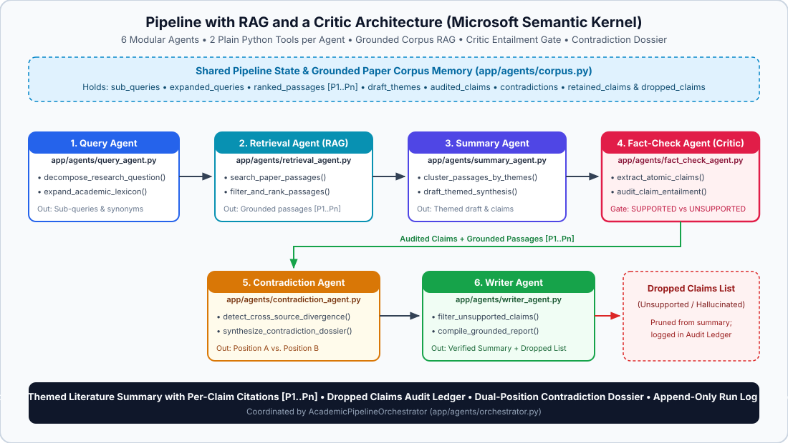
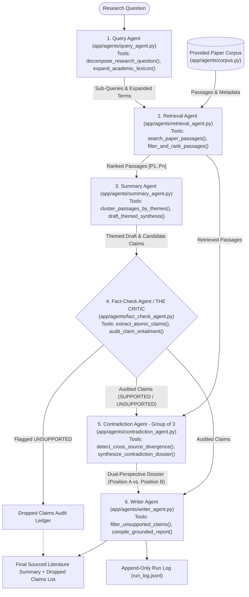

# Multi-Agent Coordination Architecture Diagram
## Pipeline with RAG and a Critic Architecture (Microsoft Semantic Kernel)

```mermaid
flowchart TD
    User(["Research Question"]) --> Q["1. Query Agent (app/agents/query_agent.py)<br/>Tools: decompose_research_question(), expand_academic_lexicon()"]
    Q -->|"Sub-Queries & Expanded Terms"| R["2. Retrieval Agent (app/agents/retrieval_agent.py)<br/>Tools: search_paper_passages(), filter_and_rank_passages()"]
    Corpus[("Provided Paper Corpus<br/>(app/agents/corpus.py)")] -->|"Passages & Metadata"| R
    R -->|"Ranked Passages [P1..Pn]"| S["3. Summary Agent (app/agents/summary_agent.py)<br/>Tools: cluster_passages_by_themes(), draft_themed_synthesis()"]
    S -->|"Themed Draft & Candidate Claims"| F{"4. Fact-Check Agent / THE CRITIC<br/>(app/agents/fact_check_agent.py)<br/>Tools: extract_atomic_claims(), audit_claim_entailment()"}
    F -->|"Flagged UNSUPPORTED"| Dropped["Dropped Claims Audit Ledger"]
    F -->|"Audited Claims (SUPPORTED / UNSUPPORTED)"| C["5. Contradiction Agent - Group of 3<br/>(app/agents/contradiction_agent.py)<br/>Tools: detect_cross_source_divergence(), synthesize_contradiction_dossier()"]
    R -->|"Retrieved Passages"| C
    C -->|"Dual-Perspective Dossier (Position A vs. Position B)"| W["6. Writer Agent (app/agents/writer_agent.py)<br/>Tools: filter_unsupported_claims(), compile_grounded_report()"]
    F -->|"Audited Claims"| W
    W --> Out["Final Sourced Literature Summary + Dropped Claims List"]
    W --> Log["Append-Only Run Log (run_log.jsonl)"]
    Dropped -.-> Out
```

